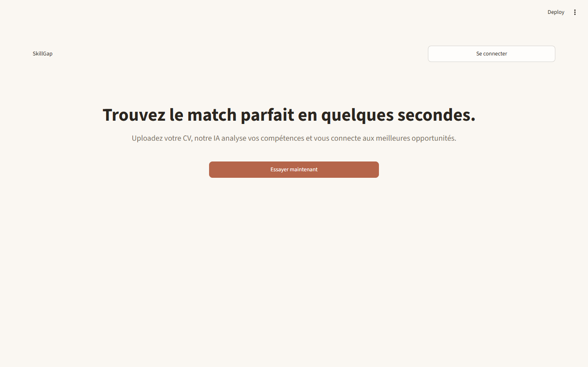
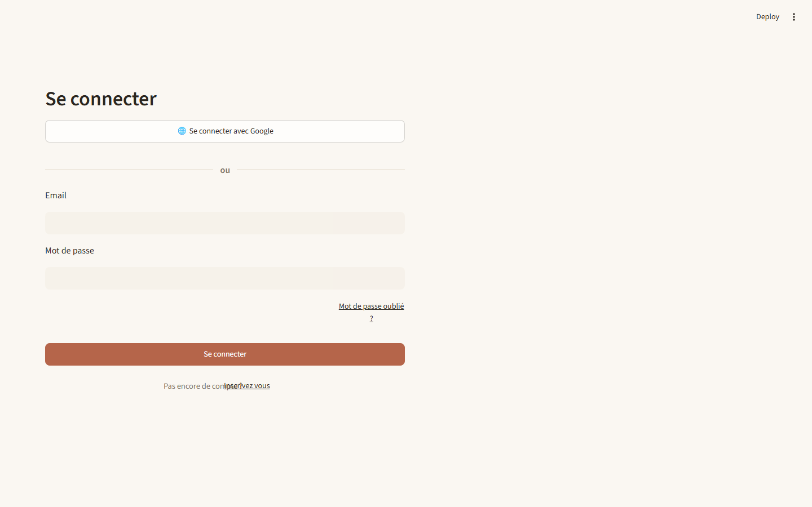
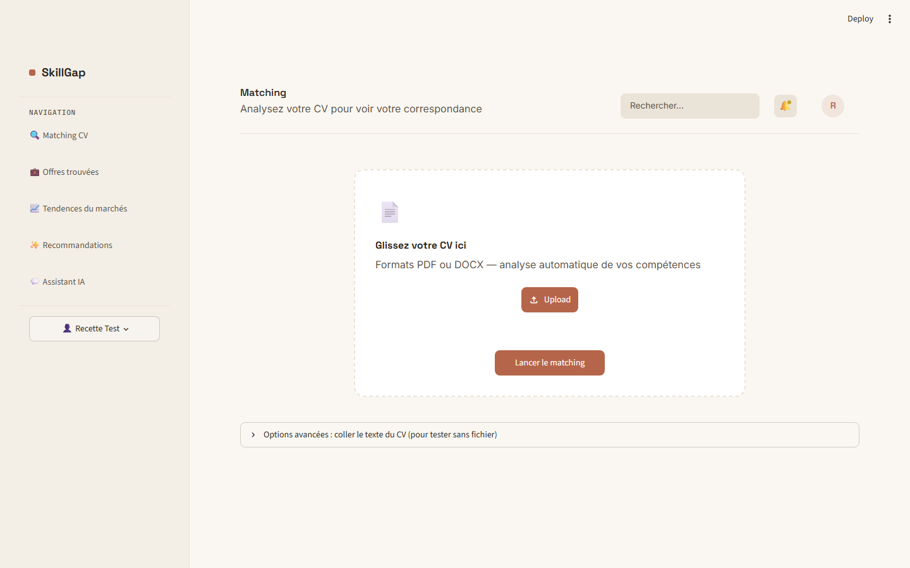
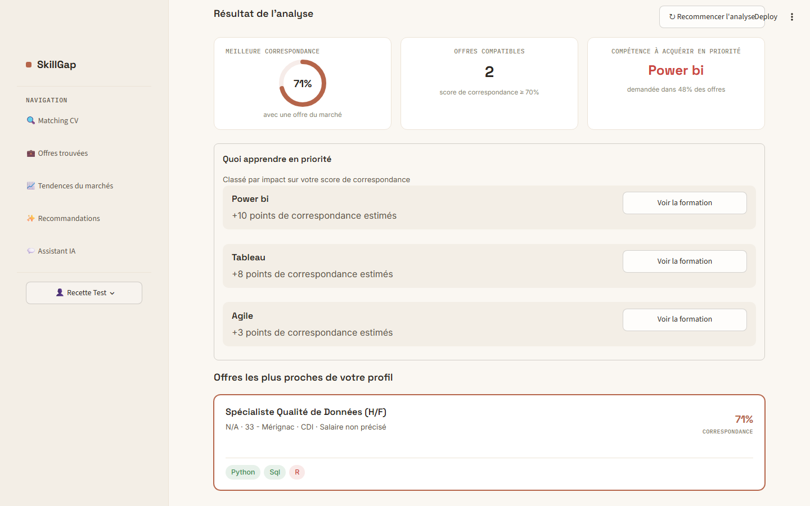
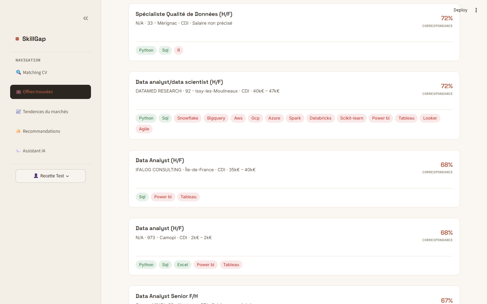
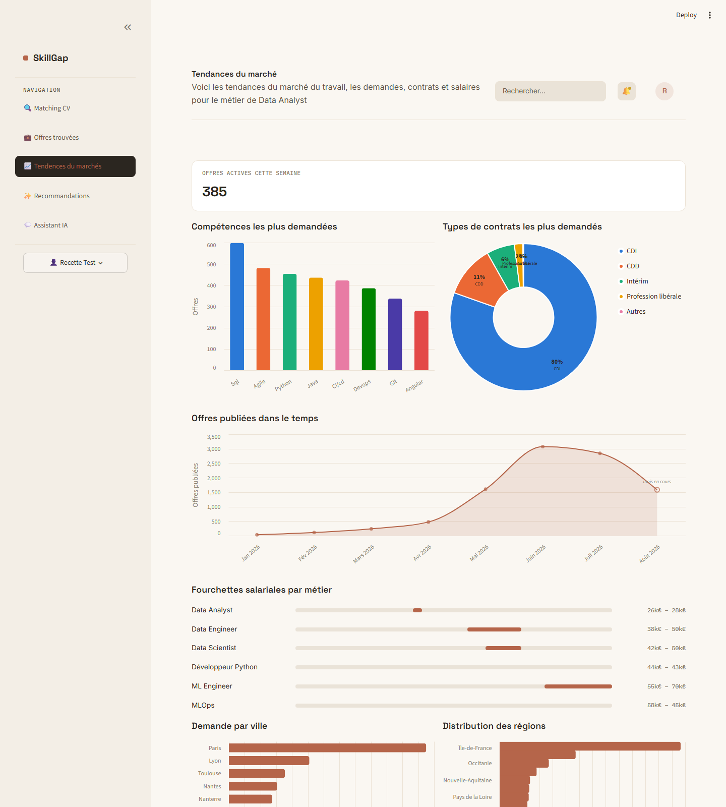
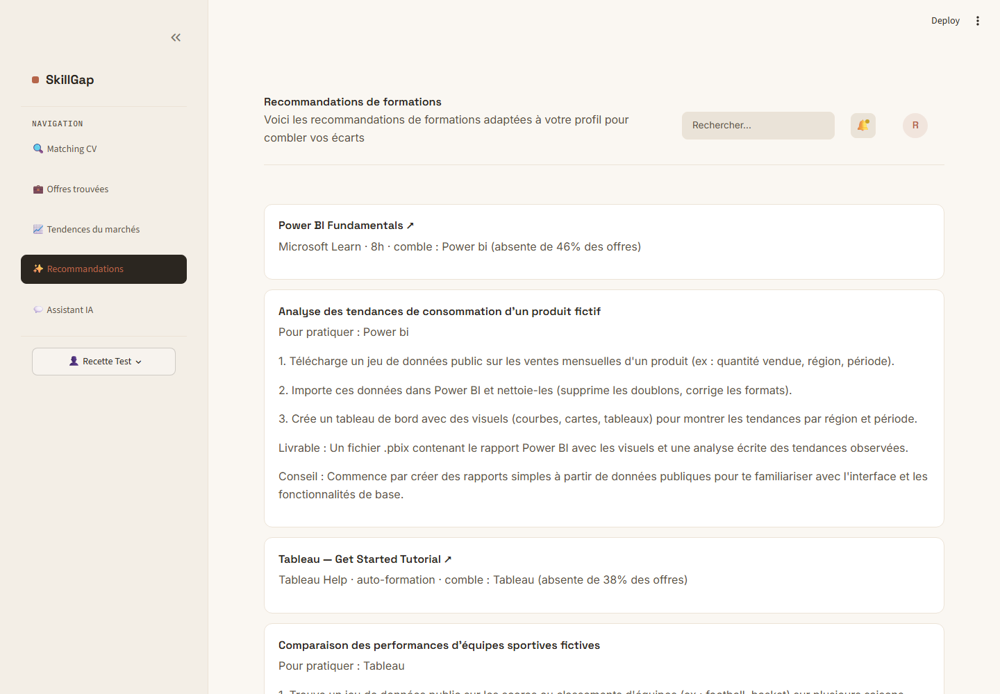
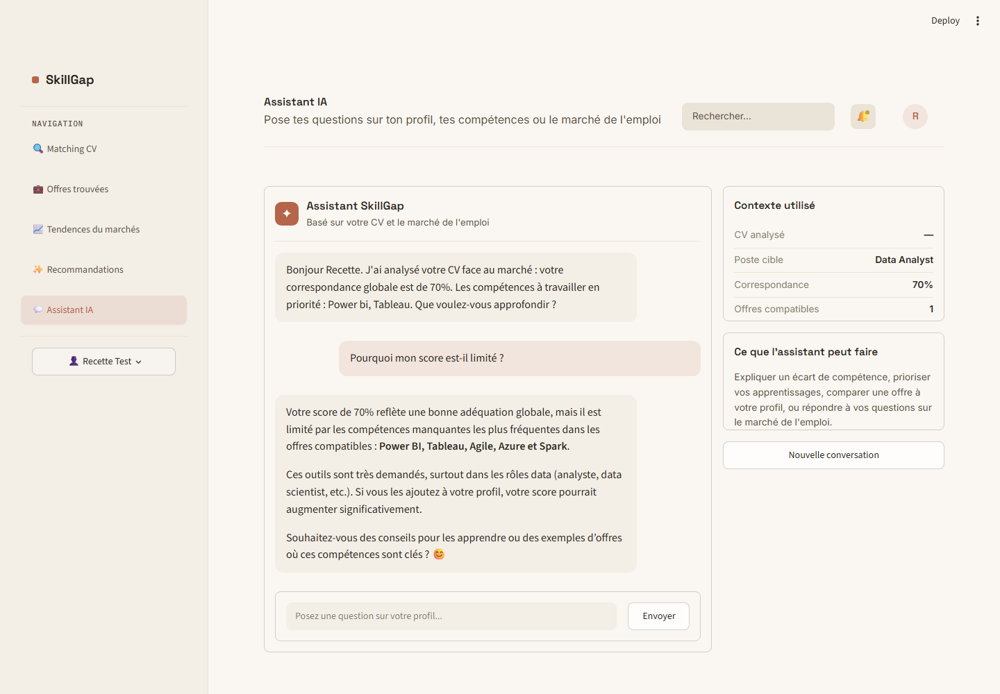

# [NOM DE L'ÉCOLE]

**[Formation / Titre visé, ex. : Master Data Engineer — Titre RNCP Niveau 7]**

---

# Projet de Fin d'Études

En vue de l'obtention du **[Nom exact du diplôme]**

## SkillGap : une plateforme de matching CV — offres d'emploi et de recommandation de formations assistée par IA

---

Présenté par
**Fidélia SOWAKOUDE**

Réalisé [au sein de / dans le cadre de] **[Nom de l'entreprise / du contexte du projet, si applicable]**

Encadrant(e) : **[Nom de l'encadrant·e]**

**[Mois AAAA] – [Mois AAAA]**

---
---

## Remerciements

*[À compléter — section personnelle. Exemple de structure à suivre, comme dans les mémoires similaires : remerciements à l'encadrant·e, à l'école/l'entreprise d'accueil, aux proches, et un mot de conclusion personnel sur le parcours accompli.]*

---

## Table des matières

- Introduction générale
- **Chapitre 1 — Introduction générale du projet**
  1. Contexte du projet
  2. Problématique
  3. Enjeux
  4. Objectifs du projet
- **Chapitre 2 — Analyse des besoins et spécifications**
  1. Besoins fonctionnels
  2. Exigences non-fonctionnelles et contraintes techniques
  3. Choix technologiques et justification
  4. Cartographie des besoins et fonctionnalités
- **Chapitre 3 — Conception et architecture**
  1. Vue d'ensemble de l'architecture
  2. Les composants de l'infrastructure
  3. Authentification et sécurité
  4. Limites d'architecture assumées
- **Chapitre 4 — Collecte des données**
  1. La source France Travail
  2. Le script de collecte et son orchestration
  3. Stockage brut dans MinIO (bronze)
- **Chapitre 5 — Transformation, chargement et vectorisation des données**
  1. De bronze à silver : nettoyage et normalisation
  2. De silver à gold : chargement dans PostgreSQL
  3. Vectorisation des offres
- **Chapitre 6 — Le moteur de matching CV**
  1. Extraction du texte et des compétences du CV
  2. Recherche par similarité vectorielle avec pgvector
  3. Calcul des écarts de compétences
- **Chapitre 7 — L'application Streamlit**
  1. Choix de Streamlit et organisation du code
  2. Page Matching CV
  3. Page Offres trouvées
  4. Page Tendances du marché
- **Chapitre 8 — Fonctionnalités IA avancées : recommandations et assistant conversationnel**
  1. Le choix de Mistral AI
  2. Le catalogue de formations vérifié manuellement
  3. Génération de projets pratiques par IA
  4. L'assistant conversationnel ancré sur le profil
- **Chapitre 9 — Automatisation avec Apache Airflow**
  1. Architecture des DAGs
  2. Le DAG orchestrateur
  3. Avantages et limites de l'automatisation actuelle
- **Chapitre 10 — Tests, sécurité et qualité**
  1. Stratégie de test actuelle
  2. Sécurité et confidentialité
  3. Limites connues et dette technique
- Conclusion générale et perspectives
- Bibliographie

## Table des figures

- Figure 3.1 — Page d'accueil de SkillGap
- Figure 3.2 — Page de connexion
- Figure 7.1 — Dépôt du CV sur la page Matching
- Figure 7.2 — Résultat d'analyse du matching CV
- Figure 7.3 — Page Offres trouvées
- Figure 7.4 — Page Tendances du marché
- Figure 8.1 — Page Recommandations de formations
- Figure 8.2 — Assistant IA conversationnel

---

## Introduction générale

La recherche d'un premier poste ou d'une reconversion dans le secteur de la data se heurte aujourd'hui à un paradoxe : le marché de l'emploi n'a jamais publié autant d'offres, mais un candidat individuel a rarement les moyens de savoir, précisément, ce qui le sépare du poste qu'il vise. Les offres sont dispersées entre plusieurs plateformes, les intitulés de compétences varient d'une entreprise à l'autre, et rien ne relie mécaniquement le contenu d'un CV aux exigences réelles du marché à un instant donné.

SkillGap est né de cette observation. Le projet ne se contente pas de centraliser des offres d'emploi : il analyse sémantiquement un CV, le compare au marché réel via une base d'offres vectorisées, en déduit les compétences manquantes les plus déterminantes, puis referme la boucle en proposant des formations vérifiées et un accompagnement conversationnel pour combler ces écarts.

Ce rapport présente la conception et la réalisation de SkillGap : le contexte et les objectifs du projet, l'analyse des besoins, l'architecture technique retenue, le pipeline de collecte et de traitement des données, le moteur de matching sémantique, l'application elle-même, et les fonctionnalités d'intelligence artificielle générative qui distinguent SkillGap d'un simple agrégateur d'offres. Une attention particulière est portée, tout au long du document, à la distinction entre ce qui est effectivement implémenté et testé, et ce qui reste une perspective d'évolution — un choix délibéré de rigueur plutôt que d'exhaustivité apparente.

---

# Chapitre 1 — Introduction générale du projet

## 1. Contexte du projet

Le secteur de la data (data analyst, data engineer, data scientist, MLOps...) connaît en France une croissance soutenue de la demande, portée par la généralisation des usages de la donnée et de l'intelligence artificielle dans les entreprises. Cette dynamique s'accompagne d'un paradoxe bien documenté : la multiplication des offres ne facilite pas la recherche d'emploi, elle la complique. Les candidats doivent composer avec des intitulés de poste hétérogènes, des référentiels de compétences qui varient d'une entreprise à l'autre, et l'absence d'un outil qui leur dise, concrètement, où se situe l'écart entre leur profil actuel et un poste visé.

SkillGap répond à ce constat en proposant une plateforme qui ne se contente pas d'agréger des offres, mais qui les met en relation directe avec le profil réel du candidat, via une analyse sémantique de son CV.

## 2. Problématique

Comment permettre à un candidat de comprendre, de façon quantifiée et actionnable, ce qui le sépare des offres d'emploi correspondant à son projet professionnel — et de savoir précisément quoi apprendre en priorité pour combler cet écart ?

## 3. Enjeux

- **Objectiver le matching** : remplacer la recherche par mots-clés, peu fiable dès que les intitulés de compétences varient, par une comparaison sémantique du contenu réel du CV et des offres.
- **Rendre l'écart actionnable** : ne pas se contenter d'un score de compatibilité, mais identifier précisément les compétences manquantes les plus déterminantes et donner un chemin concret pour les acquérir.
- **Rester honnête sur les données proposées** : ne jamais présenter au candidat une formation ou une ressource inventée — un enjeu de confiance central dès lors qu'on introduit de l'IA générative dans le parcours.
- **Automatiser la fraîcheur des données** : le marché de l'emploi évolue en continu ; la pertinence du matching dépend directement de la régularité de la collecte des offres.

## 4. Objectifs du projet

1. Centraliser des offres d'emploi réelles issues d'une source publique fiable (France Travail), avec un pipeline de collecte automatisé et reproductible.
2. Développer un moteur de matching sémantique CV ↔ offres, fondé sur des embeddings vectoriels plutôt que sur une simple correspondance de mots-clés.
3. Calculer, pour chaque candidat, un classement objectif des compétences qui lui manquent le plus fréquemment par rapport aux offres auxquelles il correspond.
4. Proposer des ressources de formation réelles et vérifiées pour combler ces écarts, sans recourir à du contenu généré par IA sur des faits vérifiables.
5. Accompagner le candidat au-delà du résultat brut, via un assistant conversationnel capable d'expliquer son score et de le conseiller, ancré sur son profil réel.
6. Automatiser l'ensemble du pipeline de données (collecte → transformation → chargement → vectorisation) pour que la plateforme reste à jour sans intervention manuelle quotidienne.

---

# Chapitre 2 — Analyse des besoins et spécifications

## 1. Besoins fonctionnels

**Authentification** — un candidat doit pouvoir créer un compte et se connecter pour accéder à son espace personnel.

**Analyse de CV** — le candidat dépose un CV (PDF ou DOCX) ; le système en extrait le texte, le compare sémantiquement au marché, et affiche un score de correspondance ainsi que les offres les plus proches de son profil.

**Détection des écarts de compétences** — pour chaque offre comparée, le système distingue les compétences déjà maîtrisées de celles qui manquent, puis agrège ces écarts à l'échelle de l'ensemble des offres pertinentes pour dégager une priorité d'apprentissage.

**Recommandations de formation** — à partir des écarts détectés, le système propose des ressources de formation réelles, ainsi qu'une idée de projet pratique pour s'exercer sur chaque compétence manquante.

**Assistant conversationnel** — le candidat peut poser des questions en langage naturel sur son profil, ses compétences ou le marché de l'emploi, et obtenir des réponses ancrées sur ses propres résultats de matching.

**Exploration du marché** — au-delà de son propre profil, le candidat doit pouvoir consulter des tendances agrégées du marché (compétences les plus demandées, types de contrats, fourchettes salariales, répartition géographique).

## 2. Exigences non-fonctionnelles et contraintes techniques

**Confidentialité du CV** — le contenu du CV est une donnée personnelle sensible. Le projet fait le choix explicite de ne jamais transmettre le texte brut du CV à un service tiers pour les fonctionnalités génératives récurrentes (recommandations, conversation) — seuls les labels de compétences extraits sont envoyés au modèle de langage. Une exception assumée existe : l'extraction automatique du poste visé (chapitre 8) envoie le texte du CV à Mistral pour cette tâche ponctuelle, ce qui est documenté ici pour rester rigoureux plutôt que de prétendre à une confidentialité absolue.

**Fiabilité du contenu généré par IA** — un LLM peut halluciner un fait vérifiable (le nom d'une formation qui n'existe pas, un lien mort). Le projet distingue donc explicitement ce qui doit rester factuel et vérifié manuellement (le catalogue de formations) de ce qui peut être génératif sans risque (une idée de projet pratique, qui n'a pas de « bonne réponse » à inventer).

**Fraîcheur des données** — le matching ne doit considérer que des offres réellement actives ; une fenêtre glissante de 30 jours est appliquée.

**Reproductibilité de l'environnement** — l'ensemble de la stack doit pouvoir être démarré de façon identique sur n'importe quelle machine, via conteneurisation.

## 3. Choix technologiques et justification

| Choix | Justification |
|---|---|
| **Streamlit** | Permet de construire une interface interactive complète en Python pur, sans développer un frontend séparé — cohérent avec un projet porté par une seule personne dans un temps contraint. |
| **PostgreSQL + pgvector** | Une seule base relationnelle sert à la fois de stockage classique (offres, utilisateurs) et de moteur de recherche vectorielle (colonne `embedding vector(384)`), évitant de maintenir un moteur de recherche dédié séparé. |
| **MinIO** | Stockage objet compatible S3 pour organiser le pipeline de données selon une architecture en médaillon (bronze / silver / gold), sans dépendre d'un cloud provider payant en développement. |
| **Apache Airflow** | Orchestration et planification du pipeline de collecte/transformation/chargement, avec reprise sur erreur et traçabilité des exécutions. |
| **sentence-transformers (`paraphrase-multilingual-MiniLM-L12-v2`)** | Modèle d'embeddings multilingue, adapté au français, suffisamment léger pour tourner sans GPU dédié — le choix a été fait au profit de la simplicité opérationnelle plutôt que de la performance maximale. |
| **Mistral AI** | Fournisseur de LLM choisi pour la génération de contenu conversationnel/créatif (recommandations, chat) — comparé explicitement à Google Gemini en cours de projet (accès gratuit équivalent, mais SDK déjà intégré et meilleure adéquation au français pour du contenu candidat). |
| **Docker / Docker Compose** | Isolation et reproductibilité de chaque service (base de données, stockage, orchestration, application). |

## 4. Cartographie des besoins et fonctionnalités

| Besoin | Solution fonctionnelle | Technologie associée |
|---|---|---|
| Authentification | Formulaire de connexion/inscription, mots de passe hachés | `bcrypt`, PostgreSQL |
| Centralisation des offres | Pipeline automatisé de collecte et chargement | France Travail API, Airflow, MinIO |
| Matching sémantique | Comparaison d'embeddings CV/offres | `sentence-transformers`, pgvector |
| Détection des écarts | Comparaison ensembliste des compétences par offre | Référentiel `skills_reference.py`, Python |
| Recommandations de formation | Catalogue vérifié + génération de projets pratiques | Catalogue statique, Mistral AI |
| Assistant conversationnel | Chat contextualisé sur le profil du candidat | Mistral AI (chat) |
| Exploration du marché | Tableaux de bord agrégés | Altair, `market_stats.py` |
| Automatisation | Pipeline planifié et rejouable | Apache Airflow |

---

# Chapitre 3 — Conception et architecture

## 1. Vue d'ensemble de l'architecture

SkillGap suit une architecture en médaillon (bronze / silver / gold), orchestrée par Airflow, qui alimente une base PostgreSQL unique servant à la fois de base applicative classique et de moteur de recherche vectorielle grâce à l'extension `pgvector`. L'application Streamlit consulte directement cette base — il n'existe pas d'API REST intermédiaire en production (voir §4, une limite assumée).

```
France Travail (API)
        │
        ▼
  [Airflow: ingestion_dags]  ──▶  MinIO/bronze (JSON brut)
        │
        ▼
[Airflow: transformation_silver_dag]  ──▶  MinIO/silver (Parquet nettoyé)
        │
        ▼
   [Airflow: dag_load_to_gold]
        │  ├─ chargement + upsert  ──▶  PostgreSQL (offres_emploi)
        │  └─ vectorisation manquante ──▶  colonne embedding (pgvector)
        ▼
  [Airflow: dag_master (@daily)] orchestre les 3 DAGs ci-dessus,
  puis (re)crée l'index HNSW de similarité cosinus
        │
        ▼
   Application Streamlit  ◀────────────  Mistral AI (recommandations, chat)
   (lit directement PostgreSQL)
```

## 2. Les composants de l'infrastructure

| Service | Rôle |
|---|---|
| `postgres` (image `pgvector/pgvector:pg17`) | Base applicative unique : utilisateurs, offres, embeddings |
| `pgadmin` | Interface d'administration de la base |
| `minio` | Stockage objet du pipeline (bronze/silver/gold) |
| `airflow-webserver` / `airflow-scheduler` | Orchestration et planification du pipeline de données |
| `streamlit` | L'application elle-même |

Chaque service est conteneurisé et démarré via `docker-compose`, ce qui garantit un environnement de développement reproductible à l'identique sur n'importe quelle machine.

## 3. Authentification et sécurité

L'inscription et la connexion reposent sur un formulaire Streamlit classique (`frontend/views/authentification.py`), adossé à une table `users` PostgreSQL (`id`, `nom`, `prenom`, `email`, `password_hash`, `role`, `created_at`). Les mots de passe ne sont jamais stockés en clair : ils sont hachés avec `bcrypt`, avec un sel aléatoire propre à chaque utilisateur.

L'accès aux pages de l'application est conditionné à l'état `logged_in` de la session Streamlit, vérifié de façon centralisée au niveau du routeur principal de l'application plutôt que page par page.

## 4. Limites d'architecture assumées

Par souci de rigueur, ce mémoire documente explicitement les choix d'architecture qui restent perfectibles plutôt que de les passer sous silence :

- **Pas d'API REST active en production.** Un service FastAPI existe dans le dépôt (`backend/`) mais son bloc est commenté dans `docker-compose.yml` : toute la logique métier s'exécute directement dans le processus Streamlit, qui interroge PostgreSQL en direct. C'est un choix pragmatique pour un projet porté par une seule personne, mais qui ne permettrait pas, en l'état, de servir un futur client mobile ou une intégration tierce sans développement supplémentaire.
- **Pas de vérification d'e-mail ni de réinitialisation de mot de passe fonctionnelle.** Le format de l'e-mail est validé, mais aucun lien de confirmation n'est envoyé ; le bouton « mot de passe oublié » affiche une confirmation sans déclencher d'envoi réel.
- **Le champ `role` de la table `users`** existe dans le schéma mais n'est lu par aucune logique d'autorisation : il n'y a aujourd'hui qu'un seul niveau d'accès effectif.
- **Absence de monitoring et de CI/CD** : contrairement à un pipeline de production complet, ce projet ne dispose pas (encore) de supervision temps réel (type Prometheus/Grafana) ni d'intégration continue automatisée sur chaque push — un axe d'amélioration identifié en conclusion.

---

# Chapitre 4 — Collecte des données

## 1. La source France Travail

SkillGap s'appuie sur une source de données unique et assumée : l'API publique **France Travail**, choisie après une évaluation explicite d'alternatives par scraping (Welcome to the Jungle, APEC). Ces deux plateformes se sont révélées protégées par des dispositifs anti-bot robustes (AWS WAF côté Welcome to the Jungle, DataDome côté APEC), bloquant même de simples requêtes vers des ressources publiques comme `robots.txt`. Plutôt que de contourner ces protections — au prix d'une fragilité technique et d'un risque vis-à-vis des conditions d'utilisation de ces plateformes — le choix a été fait de rester sur une source officielle, documentée et stable dans le temps.

## 2. Le script de collecte et son orchestration

Le script `scripts/recup_france_travail.py` s'authentifie auprès de l'API via OAuth2 (client credentials), avec les identifiants injectés comme variables Airflow (`CLIENT_ID`/`CLIENT_SECRET`). Il interroge l'endpoint de recherche d'offres pour un ensemble de métiers ciblés (data engineer, data analyst, data scientist, machine learning engineer, MLOps, développeur python), sans restriction géographique, avec une pagination par tranches de 149 résultats jusqu'à épuisement des résultats disponibles.

## 3. Stockage brut dans MinIO (bronze)

Chaque lot d'offres collectées est déposé tel quel (format JSON brut, fidèle à la réponse de l'API) dans le bucket MinIO `bronze`, accompagné d'un rapport de collecte. Ce choix — conserver la donnée brute avant toute transformation — permet de rejouer les étapes suivantes du pipeline sans avoir à re-solliciter l'API en cas d'évolution des règles de nettoyage.

---

# Chapitre 5 — Transformation, chargement et vectorisation des données

## 1. De bronze à silver : nettoyage et normalisation

Le script `scripts/transform_datafr.py` lit les fichiers JSON bruts et construit un jeu de données structuré : titre, description, compétences et langues détectées, type de contrat, niveau de diplôme requis, localisation, fourchette salariale (extraite par expression régulière du champ texte de l'API), secteur d'activité. Le résultat est enregistré au format Parquet dans le bucket `silver`. L'étape est idempotente : un fichier déjà transformé n'est pas retraité.

## 2. De silver à gold : chargement dans PostgreSQL

Le script `scripts/load_to_postgres.py` charge les fichiers Parquet vers la table `offres_emploi`, avec une opération d'upsert (`INSERT ... ON CONFLICT (source_url) DO UPDATE`) garantissant qu'une offre déjà connue est mise à jour plutôt que dupliquée. Point notable : les compétences finalement stockées ne sont pas directement celles renvoyées par l'API France Travail, mais **re-extraites depuis la description** de l'offre via un référentiel de compétences partagé (`scripts/skills_reference.py`) — la même fonction `extract_skills()` est utilisée côté offres et côté CV, ce qui garantit que les deux se comparent avec exactement le même vocabulaire.

Ce référentiel couvre **96 compétences uniques**, réparties en 8 catégories (langages backend, langages frontend, bases de données, cloud & infrastructure, data engineering, IA/ML, no-code, méthodologies & outils).

## 3. Vectorisation des offres

La colonne `embedding` n'est pas remplie au moment du chargement : elle est calculée séparément par `scripts/vectorisateur_data.py`, qui sélectionne les offres dont l'embedding est encore vide, encode leur description avec le modèle `paraphrase-multilingual-MiniLM-L12-v2`, et met à jour la base par lots. Ce découpage volontaire (chargement ≠ vectorisation) permet de relancer l'un sans l'autre, et de ne jamais recalculer un embedding déjà existant.

---

# Chapitre 6 — Le moteur de matching CV

## 1. Extraction du texte et des compétences du CV

Le candidat dépose un fichier PDF ou DOCX (`frontend/back_service/cv_parser.py`, `pdfplumber`/`python-docx`) ou colle directement le texte de son CV. Le texte est ensuite passé à la même fonction `extract_skills()` que celle utilisée côté offres, pour détecter les compétences présentes.

## 2. Recherche par similarité vectorielle avec pgvector

Le cœur du matching (`scripts/matching_cv.py`, fonction `find_best_matches`) encode le texte du CV avec le même modèle d'embeddings que les offres, puis exécute une recherche de similarité directement en SQL grâce à l'opérateur de distance cosinus de `pgvector` :

```sql
SELECT titre, company, ..., 1 - (embedding <=> %s::vector) AS similarity_score
FROM offres_emploi
WHERE date_du_poste >= NOW() - INTERVAL '30 days'
  AND embedding IS NOT NULL
ORDER BY similarity_score DESC
LIMIT %s;
```

Seules les offres publiées dans les 30 derniers jours sont considérées, pour garantir la pertinence du résultat par rapport au marché réel du moment.

## 3. Calcul des écarts de compétences

Pour chaque offre retournée, les compétences détectées dans le CV sont comparées ensemblistement à celles de l'offre, produisant deux listes : `matched_skills` (déjà maîtrisées) et `missing_skills` (manquantes). La fonction `rank_missing_skills()` agrège ensuite ces écarts sur l'ensemble des offres matchées, en comptant chaque compétence **une seule fois par offre** (pour ne pas gonfler artificiellement le score d'une compétence répétée plusieurs fois dans une même description), et produit un classement par fréquence : « cette compétence manque dans X % des offres correspondant à votre profil ».

C'est ce classement qui alimente directement la tuile « Compétence à acquérir en priorité » (Figure 7.2) et la page Recommandations (Chapitre 8).

---

# Chapitre 7 — L'application Streamlit

## 1. Choix de Streamlit et organisation du code

L'application est structurée en trois couches : les **vues** (`frontend/views/`, une page par fonctionnalité), les **services métier** (`frontend/back_service/`, logique réutilisable indépendante de l'affichage) et les **scripts partagés** (`scripts/`, utilisés à la fois par l'application et par les tâches Airflow — c'est le cas de `matching_cv.py` et `skills_reference.py`).

Figure 7.1 ci-dessous montre l'écran d'accueil de l'application.


*Figure 3.1 — Page d'accueil de SkillGap*


*Figure 3.2 — Page de connexion*

## 2. Page Matching CV

C'est la page d'entrée du parcours candidat : dépôt du CV (glisser-déposer PDF/DOCX, ou collage de texte pour les tests), puis affichage du résultat d'analyse — score de meilleure correspondance, nombre d'offres compatibles (score ≥ 70 %), compétence à acquérir en priorité, et un bloc « Quoi apprendre en priorité » qui renvoie directement vers une formation vérifiée pour chacune des trois compétences les plus déterminantes.


*Figure 7.1 — Dépôt du CV sur la page Matching*


*Figure 7.2 — Résultat d'analyse du matching CV*

## 3. Page Offres trouvées

Liste paginée des offres correspondant au profil du candidat, accessible uniquement après qu'un matching a été effectué (un écran d'invitation s'affiche sinon). Chaque offre affiche son pourcentage de correspondance et la liste de ses compétences, avec un code couleur distinguant celles déjà maîtrisées de celles manquantes.


*Figure 7.3 — Page Offres trouvées*

## 4. Page Tendances du marché

Indépendante du profil du candidat, cette page agrège l'ensemble des offres en base pour donner une vision du marché : compétences les plus demandées, répartition des types de contrats, évolution du nombre d'offres publiées dans le temps, fourchettes salariales par métier, et répartition géographique (ville/région — reconstruite via une table de correspondance département → région, la base ne stockant pas directement la région).


*Figure 7.4 — Page Tendances du marché*

---

# Chapitre 8 — Fonctionnalités IA avancées : recommandations et assistant conversationnel

C'est la partie du projet qui distingue le plus nettement SkillGap d'un simple moteur de matching : transformer un écart de compétences détecté en un chemin d'action concret, sans jamais sacrifier la fiabilité de l'information au profit de la fluidité de l'IA générative.

## 1. Le choix de Mistral AI

Deux fournisseurs de LLM ont été comparés explicitement en cours de projet : Google Gemini et Mistral AI. Les deux offrent un accès gratuit exploitable pour ce projet. Le choix s'est porté sur Mistral pour trois raisons : une meilleure adéquation au traitement du français (pertinent puisque l'ensemble du contenu candidat — CV, conversation — est en français), une politique de confidentialité plus simple à désactiver sur le tier gratuit (l'entraînement sur les données utilisateur peut être désactivé directement depuis la console, sans devoir lier de moyen de paiement comme l'exige Gemini pour les utilisateurs européens), et un SDK déjà en place dans le projet.

## 2. Le catalogue de formations vérifié manuellement

Un principe de conception a guidé tout ce chapitre : **un LLM ne doit jamais être la source d'un fait vérifiable qu'il pourrait halluciner.** Demander à un modèle de langage de nommer une formation réelle l'expose à inventer un cours, un organisme ou un lien qui n'existent pas — un risque inacceptable pour un outil censé accompagner un vrai parcours professionnel.

Le catalogue de formations (`scripts/training_catalog.py`) a donc été construit à l'inverse : une entrée par compétence, curée manuellement, avec un lien **vérifié individuellement en HTTP (code 200)** avant intégration. Le catalogue couvre l'intégralité des 96 compétences du référentiel, avec un filet de sécurité générique (une recherche sur une plateforme de formation stable) pour toute compétence qui ne serait pas encore couverte si le référentiel venait à s'étendre.

## 3. Génération de projets pratiques par IA

À l'inverse, suggérer une idée de projet pour pratiquer une compétence est un contenu **génératif**, sans « bonne réponse » factuelle à inventer — c'est le cas d'usage confié à Mistral (`frontend/back_service/recommendation_service.py`). Pour chaque compétence manquante, le modèle produit un conseil court et un projet structuré (titre, étapes concrètes, livrable attendu), avec une consigne explicite lui interdisant d'inventer des détails vérifiables (nom précis d'un jeu de données, URL, version d'un outil) — il doit rester général plutôt que de fabriquer une fausse précision.


*Figure 8.1 — Page Recommandations de formations*

## 4. L'assistant conversationnel ancré sur le profil

L'assistant IA (`frontend/back_service/chat_service.py`, page `frontend/views/assistant_ia.py`) permet au candidat de poser des questions libres sur son profil, ses compétences ou le marché de l'emploi. Il est délibérément **cadré, sans être restreint** : le prompt système l'oriente vers les sujets carrière/compétences/emploi tout en le laissant répondre à des questions plus générales, plutôt que de les refuser systématiquement.

Son originalité tient à l'ancrage sur les données réelles du candidat : score de correspondance, compétences manquantes les plus fréquentes, et intitulé du poste visé — ce dernier étant lui-même extrait automatiquement du texte du CV par une requête dédiée à Mistral (avec consigne stricte de ne rien inventer si aucun poste n'est explicitement indiqué). Le panneau « Contexte utilisé », visible à l'écran, rend cet ancrage transparent pour l'utilisateur plutôt que de le laisser deviner sur quelles données l'assistant s'appuie.


*Figure 8.2 — Assistant IA conversationnel*

---

# Chapitre 9 — Automatisation avec Apache Airflow

## 1. Architecture des DAGs

Le pipeline de données est découpé en quatre DAGs distincts plutôt qu'un unique script monolithique, pour que chaque étape (ingestion, transformation, chargement + vectorisation) reste indépendamment rejouable :

- `ingestion_dags` — collecte depuis l'API France Travail.
- `transformation_silver_dag` — nettoyage et normalisation bronze → silver.
- `dag_load_to_gold` — chargement en base puis vectorisation des offres nouvellement insérées.
- `master_pipeline_full_workflow` — orchestrateur.

## 2. Le DAG orchestrateur

`master_pipeline_full_workflow` s'exécute quotidiennement (`schedule_interval='@daily'`) et déclenche les trois DAGs précédents en séquence stricte (chacun devant réussir avant que le suivant ne démarre), avant de (re)créer, si besoin, l'index de similarité cosinus HNSW sur la colonne `embedding` — une opération idempotente rejouée chaque jour à coût nul une fois l'index déjà en place.

## 3. Avantages et limites de l'automatisation actuelle

L'automatisation garantit que la base reste alimentée sans intervention manuelle quotidienne, avec une traçabilité complète des exécutions via l'interface Airflow (statut, durée, logs par tâche). Les exécutions observées sur la période du projet montrent un pipeline globalement fiable, avec un taux d'échec ponctuel normal pour un système dépendant d'une API tierce externe.

Une limite assumée : le pipeline ne gère pas la suppression des offres devenues obsolètes côté source — une offre n'est mise à jour que si elle réapparaît dans une collecte, jamais explicitement retirée si elle disparaît de l'API. C'est pour cette raison que le moteur de matching (Chapitre 6) filtre systématiquement sur une fenêtre de 30 jours plutôt que de faire confiance à l'intégralité de la table.

---

# Chapitre 10 — Tests, sécurité et qualité

## 1. Stratégie de test actuelle

Le projet dispose d'une suite de tests unitaires réels, fondés sur des assertions et exécutables sans dépendance externe (`scripts/test_matching_helpers.py`, `pytest`), qui couvre la logique de classement des écarts de compétences (`rank_missing_skills`) et le résumé de profil (`get_profile_summary`) : cas limites (liste vide, aucun écart), arrondi du seuil de compatibilité, déduplication des compétences répétées au sein d'une même offre. D'autres scripts de test existent dans le dépôt mais restent, en l'état, des scripts de vérification manuelle (impression de résultats sans assertion, ou dépendance à une base de données ou un fichier local déjà présent) plutôt que des tests automatisables en intégration continue — un axe d'amélioration explicitement identifié plutôt que négligé.

## 2. Sécurité et confidentialité

- Mots de passe hachés avec `bcrypt` (sel aléatoire par utilisateur), jamais stockés en clair.
- Fichier `.env` exclu du dépôt Git ; les secrets (identifiants base de données, clé API Mistral) sont injectés par variables d'environnement.
- Le contenu du CV n'est jamais transmis à un service tiers pour les fonctionnalités récurrentes (recommandations, conversation) — seuls des labels de compétences le sont ; une exception ponctuelle et documentée existe pour l'extraction du poste visé (Chapitre 8).
- Une revue de sécurité ciblée sur les fonctionnalités IA n'a révélé aucune vulnérabilité à haute confiance exploitable par un tiers (méthodologie : identification puis vérification indépendante de chaque piste, avec un score de confiance minimal requis avant retenue).

## 3. Limites connues et dette technique

Dans un souci de transparence, les limites suivantes sont documentées plutôt que dissimulées :

- Absence de vérification d'e-mail et de réinitialisation de mot de passe fonctionnelle.
- Absence d'API REST active malgré une base de code préparée en ce sens (Chapitre 3).
- Absence de supervision applicative temps réel (pas d'équivalent Prometheus/Grafana) et d'intégration continue automatisée.
- Certains identifiants de connexion à la base de données restent codés en dur dans quelques scripts internes (cohérents avec les valeurs par défaut de l'environnement de développement, mais à corriger avant tout déploiement en production).
- Couverture de tests automatisés encore partielle (Chapitre 10, §1).

---

## Conclusion générale et perspectives

SkillGap répond à l'objectif initial du projet : transformer un CV en un diagnostic objectif de positionnement sur le marché de l'emploi data, puis en un plan d'action concret pour progresser. Le pipeline de collecte et de traitement des données est entièrement automatisé et orchestré par Airflow ; le moteur de matching s'appuie sur une comparaison sémantique réelle plutôt que sur une simple recherche par mots-clés ; les recommandations de formation reposent sur des ressources vérifiées plutôt que sur du contenu généré à l'aveugle ; et l'assistant conversationnel apporte un accompagnement personnalisé ancré sur les données réelles du candidat.

Le projet assume également, tout au long de ce rapport, ses limites actuelles : une seule source de données (choix justifié face aux protections anti-scraping des alternatives), pas d'API REST active, une couverture de tests encore partielle, et l'absence de supervision applicative en production.

**Perspectives d'évolution :**
- Étendre la couverture de tests automatisés et mettre en place une intégration continue.
- Ajouter une supervision applicative temps réel du pipeline et de l'application.
- Finaliser l'authentification (vérification d'e-mail réelle, réinitialisation de mot de passe fonctionnelle).
- Persister l'historique des conversations de l'assistant IA au-delà de la session en cours.
- Envisager l'ajout d'une seconde source de données officielle (API) pour diversifier le volume d'offres sans recourir au scraping.
- Explorer un système de retour utilisateur sur la pertinence des recommandations, pour ajuster le classement des écarts de compétences dans le temps.

---

## Bibliographie

*[À compléter avec les sources effectivement citées/consultées, au format imposé par votre école. Pistes à intégrer :]*

- Documentation officielle de l'API France Travail. https://francetravail.io/. Consulté en 2026.
- Documentation officielle de pgvector. https://github.com/pgvector/pgvector. Consulté en 2026.
- Documentation officielle de sentence-transformers. https://www.sbert.net/. Consulté en 2026.
- Documentation officielle d'Apache Airflow. https://airflow.apache.org/docs/. Consulté en 2026.
- Documentation officielle de Mistral AI. https://docs.mistral.ai/. Consulté en 2026.
- Documentation officielle de Streamlit. https://docs.streamlit.io/. Consulté en 2026.
